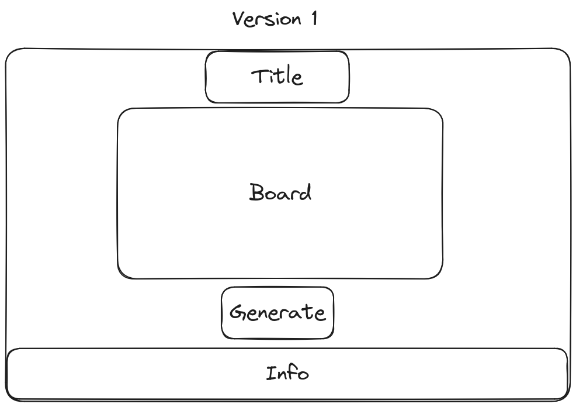
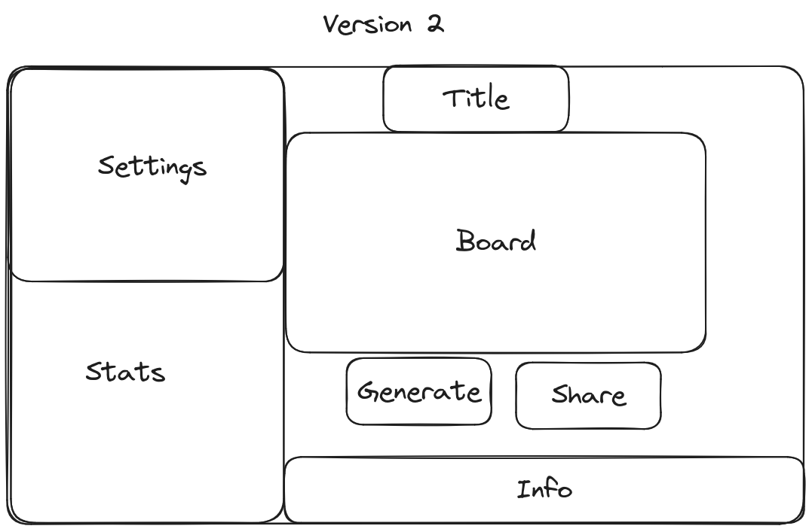

# Catan Board Generator

This website (CBG) generates random Catan board configurations. 

# Functionality
## Version 1

This is a simplified version of the generator. Functionality:

- It will generate random boards based on `Math.random()`
- No random ports
- Randomizes all tiles
- Randomizes all number tokens, but disallows 6s and 8s next to each other

## Version 2

This version will allow for more flexibility in the generation. Such as:

- Specifying a seed
- Specifying random ports
- Disallowing certain configurations of tiles
- Allowing for other board configurations (e.g. extended Catan)
- Displaying statistics of the generation (e.g. likelihood of each resource)

